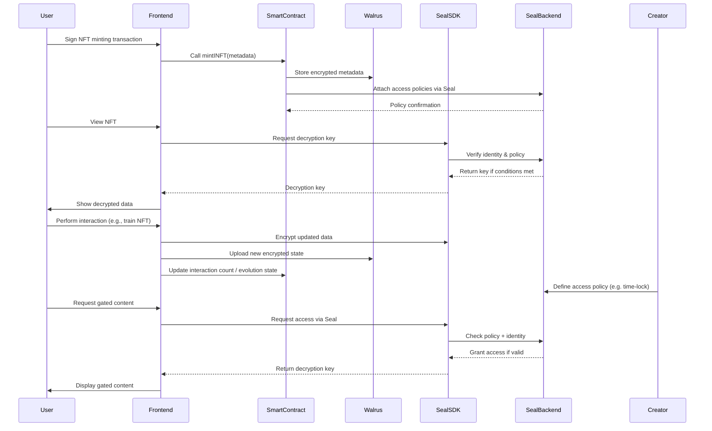

# **INFT: AI-driven, interactive NFTs with decentralized storage**.

## **Overview**

INFT (Intelligent NFT) is an innovative AI-driven NFT framework that enhances traditional NFTs by integrating **evolving intelligence, user interaction, and decentralized storage**. Unlike static NFTs that offer limited engagement beyond ownership and trading, INFTs adapt and grow based on user interactions, increasing their long-term value and utility.

By leveraging **Walrus** for cost-effective and decentralized storage on the **Sui blockchain**, INFTs provide a scalable and resilient infrastructure for digital assets that evolve dynamically over time. This project aims to create an **AI-powered NFT marketplace** where creators, collectors, and businesses can interact with intelligent NFTs, unlocking new opportunities for engagement, monetization, and utility.

## **Problem Statement**

### **Challenges with Traditional NFTs**

1. **Static Nature:** NFTs remain unchanged after minting, offering no dynamic utility.
2. **Limited Engagement:** Users have no incentive to interact beyond buying and selling.
3. **Monetization Issues:** Creators only earn from the initial sale and limited royalties.
4. **Lack of Scalability:** Many NFTs rely on costly, inefficient storage solutions.
5. **Underutilized AI Potential:** No direct AI-driven mechanisms exist to enhance NFTs.

## **Solution: INFT Framework**

INFT introduces **AI-powered, evolving NFTs** that grow in intelligence and value through user interactions. This is achieved through:

- **AI-Driven Learning**: INFTs adapt to interactions, enhancing engagement and utility.
- **Storage-Linked Value**: NFTs evolve based on a **storage count**, allowing owners to train their NFT by purchasing additional storage.
- **Dynamic Metadata Updates**: INFTs continuously update their metadata to reflect growth, ensuring long-term engagement.
- **Decentralized Storage**: Powered by **Walrus**, ensuring secure and verifiable metadata management.
- **Creator Royalties & Sustainable Monetization**: A dynamic royalty model rewards past owners based on their contributions to an NFT's evolution.

## **Key Features**

### **1. AI-Driven Interaction**

- INFTs respond and evolve based on user inputs and interactions.
- Learning models enable INFTs to offer tailored responses, insights, and creative outputs.

### **2. Interaction Count & Evolution Mechanism**

- Each INFT tracks its **Interaction Count**, which determines its growth and value.
- Owners can **purchase Interaction Tokens** to enhance NFT intelligence.
- NFTs evolve into higher-tier versions based on user engagement and data inputs.

### **3. Interaction Tokens (Request Quotes)**

- Utility tokens that enable NFT training and advanced interactions.
- Provide a **continuous revenue stream** by driving user engagement.

### **4. Dynamic Royalties & Incentives**

- Previous owners earn a percentage of future sales, determined by an NFT’s **Interaction Score**.
- Encourages long-term value creation and shared ecosystem growth.

### **5. INFT Marketplace**

- Central hub for buying, selling, and trading INFTs.
- Highlights an NFT’s **Interaction Score, evolution history, and unique attributes**.
- Integrated with **Sui blockchain** for seamless transactions.

## Diagram

## **Business Model**

### **Revenue Streams**

1. **Platform Revenue**
    - Transaction fees on NFT sales.
    - Fees from Interaction Token purchases.
    - Premium features for NFT customization.
2. **User Revenue**
    - Earning royalties from NFTs they’ve trained.
    - Selling evolved NFTs at higher market value.
    - Monetizing AI-powered NFT utilities for businesses and applications.

## **Roadmap**

### **Phase 1: Development & Proof of Concept**

- Research and feasibility study.
- Build core AI models for NFT evolution.
- Develop INFT smart contracts on **Sui blockchain**.
- Initial integration with **Walrus storage**.

### **Phase 2: Marketplace Launch & AI Integration**

- Launch beta version of the INFT Marketplace.
- Implement AI-driven interactions for NFT evolution.
- Enable decentralized storage with Walrus.
- Onboard initial creators and early adopters.

### **Phase 3: Expansion & Utility Enhancement**

- Expand NFT evolution features (e.g., AI-generated art, learning capabilities).
- Introduce **more advanced tokenomics & Interaction Token utilities**.
- Integrate cross-chain support.
- Partner with gaming, metaverse, and entertainment platforms.

### **Phase 4: Token Economy & INFT Token Development**

- Launch the **INFT native token** for governance, staking, and incentives.
- Expand marketplace capabilities with staking and liquidity pools.
- Develop decentralized AI-driven applications using INFT technology.

## **Partnership Strategy**

### **Key Partnership Areas**

- **Blockchain Networks**: Expansion beyond **Sui** for cross-chain compatibility.
- **AI & Storage Providers**: Collaboration with Walrus for optimized decentralized storage.
- **Gaming & Metaverse Projects**: Integration of AI-driven NFTs into gaming and virtual worlds.
- **Artists & Content Creators**: Incentivizing adoption among musicians, writers, and visual artists.

## **Token Economy**

**INFT Token Utility:**

- Used for **purchasing Interaction Tokens, staking, and governance**.
- Supports **NFT evolution, ecosystem rewards, and user engagement incentives**.
- Dynamic pricing model to **balance accessibility and sustainability**.

## **Use Cases**

1. **Dynamic Digital Art** – Artists create NFTs that evolve over time.
2. **AI-Powered Collectibles** – Gamers own NFTs that change based on achievements.
3. **Fan Engagement & Creator Royalties** – Musicians reward fans with evolving content.
4. **Education & Certification** – NFTs update with skills and achievements.
5. **Membership & Access Passes** – NFTs grant access based on user contribution.
6. **Storage-Backed NFTs** – Owners purchase storage to enhance NFT value.

## **Conclusion**

INFT is **not just another NFT platform**—it is the next evolution of digital assets. By combining **AI, decentralized storage, and dynamic engagement**, INFTs offer a **sustainable and scalable** alternative to traditional NFTs. As an **AI-powered NFT launchpad and marketplace**, INFT is set to revolutionize **digital ownership, creator economies, and Web3 interactions**.

This project is **pioneering the future** of intelligent NFTs, making digital assets **more valuable, interactive, and functional** in the long term.
