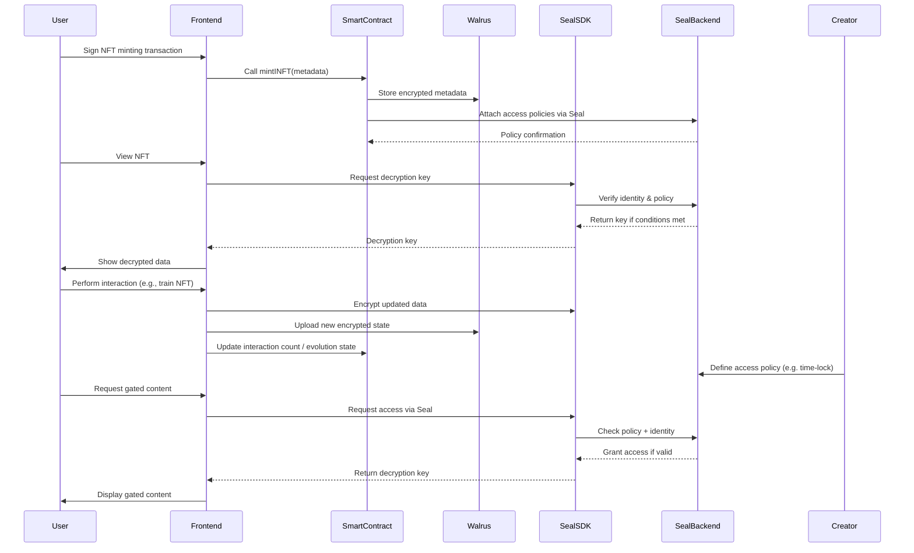

<h1 align="center">INFT: Intelligent NFT</h1>

<h3 align="center">Redefining Digital Ownership with Intelligence on SUI</h3>

  <a href="https://www.infts.xyz/" style="color: #a77dff">Platform</a> | <a href="https://www.figma.com/deck/kwP13UO8pV2k9MXNpKWfUr" style="color: #a77dff">Pitchdeck</a> | <a href="https://www.loom.com/share/4ace5226dd1249ee8b7ded31c665e289?sid=9616896b-0370-4883-809b-35ff3c3fe8d2" style="color: #a77dff">Demo Video</a>

  <a href="https://github.com/Sui-INFts/infts_protocol/blob/main/sources/infts_protocol.move" style="color: #a77dff">Sui</a> | <a href="https://github.com/Sui-INFts/infts_client/blob/main/app/create/page.tsx" style="color: #a77dff">Walrus</a> | <a href="https://github.com/Sui-INFts/infts_client/blob/main/hooks/useAtoma.ts" style="color: #a77dff">Atoma</a>

## Overview

**INFT (Intelligent NFT)** is a project designed to overcome the limitations of traditional, static, and one-way NFTs by introducing **interactive and evolving digital assets**. By integrating AI and blockchain technologies, INFT transforms NFTs from mere collectibles into intelligent digital entities capable of communication, memory, and emotional expression.

Rooted in the core Web3 principles of **personalization, interactivity, and autonomy**, INFTs grow and evolve based on user interactions. For instance, through continuous conversations or user-driven activities, an INFT’s personality, appearance, and potential functionalities dynamically change. These interactions are transparently recorded on the blockchain, ensuring verifiability, while personal data is securely protected through advanced privacy-preserving technologies.

INFT is built on the **object-oriented architecture of the Sui blockchain**, with AI computation handled within **Atoma Network’s Trusted Execution Environment (TEE)**. The project also utilizes **Seal Protocol** for conditional access to private data and **Walrus** for the separation of public and private metadata, ensuring **user trust and data sovereignty**.

Ultimately, INFT goes beyond static NFTs by pioneering a new paradigm of intelligent Web3 content — from **AI companions** and **emotionally expressive digital characters** to **evolving digital assets**. It has potential applications across gaming, messaging, the metaverse, digital humans, and more, positioning itself as a groundbreaking shift in how NFTs are conceived and used.

## Problem Statement

### Challenges with Traditional NFTs

1. **Static Nature:** NFTs remain unchanged after minting, offering no dynamic utility.
2. **Limited Engagement:** Users have no incentive to interact beyond buying and selling.
3. **Monetization Issues:** Creators only earn from the initial sale and limited royalties.
4. **Lack of Scalability:** Many NFTs rely on costly, inefficient storage solutions.
5. **Underutilized AI Potential:** No direct AI-driven mechanisms exist to enhance NFTs.

## Solution: INFT Framework

INFT introduces **AI-powered, evolving NFTs** that grow in intelligence and value through user interactions. This is achieved through:

- **AI-Driven Learning**: INFTs adapt to interactions, enhancing engagement and utility.
- **Storage-Linked Value**: NFTs evolve based on a **storage count**, allowing owners to train their NFT by purchasing additional storage.
- **Dynamic Metadata Updates**: INFTs continuously update their metadata to reflect growth, ensuring long-term engagement.
- **Decentralized Storage**: Powered by **Walrus**, ensuring secure and verifiable metadata management.
- **Creator Royalties & Sustainable Monetization**: A dynamic royalty model rewards past owners based on their contributions to an NFT's evolution.

## How it works

1. A user mint an INFT.
2. The user interacts with the AI by leveraging the Atoma network.
3. The metadata from the interaction is then self-generated and stored in Walrus storage along with the score, and an NFT is created and updated via a smart contract.

Afterwards, whenever metadata is uploaded to Walrus storage and the interaction score is updated, the data is encrypted via encryption, and the data verification and unlocking process is repeated using SEAL until the metadata is stored.

## Key Features

### 1. AI-Driven Interaction

- INFTs respond and evolve based on user inputs and interactions.
- Learning models enable INFTs to offer tailored responses, insights, and creative outputs.

### 2. Interaction Count & Evolution Mechanism

- Each INFT tracks its **Interaction Count**, which determines its growth and value.
- Owners can **purchase Interaction Tokens** to enhance NFT intelligence.
- NFTs evolve into higher-tier versions based on user engagement and data inputs.

### 3. Interaction Tokens (Request Quotes)

- Utility tokens that enable NFT training and advanced interactions.
- Provide a **continuous revenue stream** by driving user engagement.

### 4. Dynamic Royalties & Incentives

- Previous owners earn a percentage of future sales, determined by an NFT’s **Interaction Score**.
- Encourages long-term value creation and shared ecosystem growth.

### 5. INFT Marketplace

- Central hub for buying, selling, and trading INFTs.
- Highlights an NFT’s **Interaction Score, evolution history, and unique attributes**.
- Integrated with **Sui blockchain** for seamless transactions.

## Diagram

## Business Model

### Revenue Streams

1. **Platform Revenue**
    - Transaction fees on NFT sales.
    - Fees from Interaction Token purchases.
    - Premium features for NFT customization.
2. **User Revenue**
    - Earning royalties from NFTs they’ve trained.
    - Selling evolved NFTs at higher market value.
    - Monetizing AI-powered NFT utilities for businesses and applications.

## Roadmap

### Phase 1: Development & Proof of Concept (Apr 4 - May 10, 2025)
- Week 1: Research, architecture design, develop INFT smart contracts and AI logic on Sui
- Week 2: Develop frontend UI for minting/training INFTs and integrate Sui Wallet
- Week 3: Finalize MVP, perform testing, deploy to testnet/mainnet
- Week 4: Debugging, documentation, and Sui Hackathon submission

### Phase 2: AI Expansion & Industry Applications
- Expand NFT evolution features (e.g., AI-generated art, learning capabilities)
- Introduce more advanced tokenomics & Interaction Token utilities
- Integrate cross-chain support and partner with gaming, metaverse, and entertainment platforms

### Phase 3: Marketplace Launch
- Launch full-featured INFT marketplace with advanced filtering, evolution tracking, and user profile integration
- Introduce view-only and owner-only content rendering with Seal-based access controls

### Phase 4: Token Economy & INFT Token Development
- Launch the **INFT native token** for governance, staking, and incentives.
- Expand marketplace capabilities with staking and liquidity pools.
- Develop decentralized AI-driven applications using INFT technology.

## Partnership Strategy

### Key Partnership Areas

- **Blockchain Networks**: Expansion beyond **Sui** for cross-chain compatibility.
- **AI & Storage Providers**: Collaboration with Walrus for optimized decentralized storage.
- **Gaming & Metaverse Projects**: Integration of AI-driven NFTs into gaming and virtual worlds.
- **Artists & Content Creators**: Incentivizing adoption among musicians, writers, and visual artists.

## Use Cases

1. **Dynamic Digital Art** – Artists create NFTs that evolve over time
2. **AI-Powered Collectibles** – Gamers own NFTs that change based on achievements
3. **Fan Engagement & Creator Royalties** – Musicians reward fans with evolving content
4. **Education & Certification** – NFTs update with skills and achievements
5. **Membership & Access Passes** – NFTs grant access based on user contribution
6. **Storage-Backed NFTs** – Owners purchase storage to enhance NFT value
7. **Encrypted AI NFTs with Chat** – Users interact with INFTs using AI chat models like LLaMA
8. **Secure Data Sharing** – Private NFT content managed by Seal access policies and decrypted on demand

## Conclusion

INFT is **not just another NFT platform**—it is the next evolution of digital assets. By combining **AI, decentralized storage, and dynamic engagement**, INFTs offer a **sustainable and scalable** alternative to traditional NFTs. As an **AI-powered NFT launchpad and marketplace**, INFT is set to revolutionize **digital ownership, creator economies, and Web3 interactions**.

This project is **pioneering the future** of intelligent NFTs, making digital assets **more valuable, interactive, and functional** in the long term.
